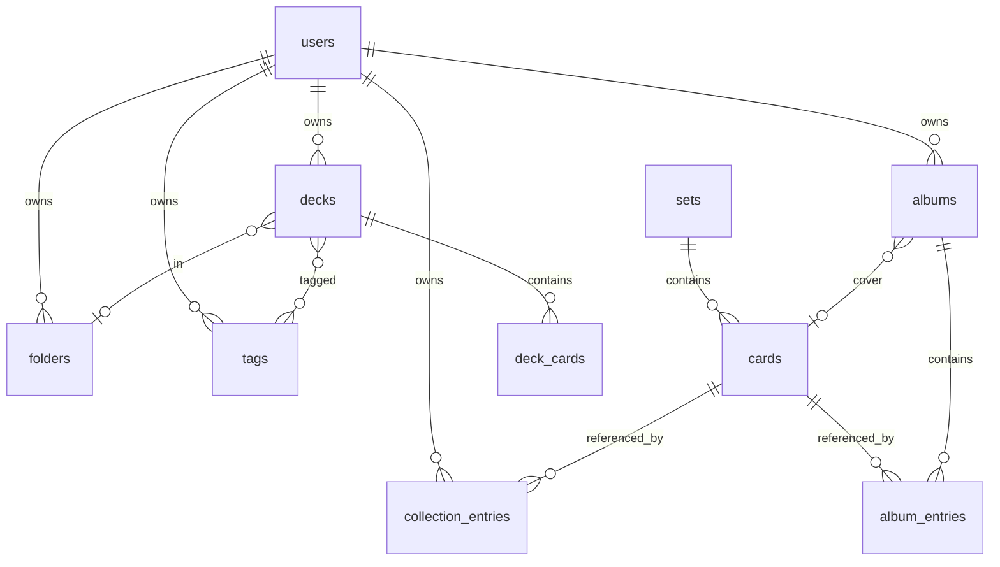

# Data Model

Database: **Neon Postgres**  
ORM: **Drizzle** (recommended)

All user tables include `user_id` for future-proofing, though only one user exists in v1.

## Entity relationship diagram



## Catalog tables (no user_id)

### `sets`

```sql
CREATE TABLE sets (
  id            TEXT PRIMARY KEY,          -- e.g. 'sv03'
  name          TEXT NOT NULL,
  series        TEXT,
  logo_url      TEXT,
  symbol_url    TEXT,
  official_count INT NOT NULL DEFAULT 0,
  total_count   INT NOT NULL DEFAULT 0,
  release_date  DATE,
  catalog_synced_at TIMESTAMPTZ
);
```

### `cards`

```sql
CREATE TABLE cards (
  id                    TEXT PRIMARY KEY,     -- TCGdex id e.g. 'sv03-185'
  name                  TEXT NOT NULL,
  normalized_name       TEXT NOT NULL,
  category              TEXT NOT NULL,          -- Pokemon | Trainer | Energy
  image_url             TEXT,
  local_id              TEXT NOT NULL,
  set_id                TEXT NOT NULL REFERENCES sets(id),
  rarity                TEXT,
  illustrator           TEXT,
  regulation_mark       TEXT,
  legal_standard_print  BOOLEAN,
  name_is_standard_legal BOOLEAN NOT NULL DEFAULT false,
  is_ace_spec           BOOLEAN NOT NULL DEFAULT false,
  is_basic_energy       BOOLEAN NOT NULL DEFAULT false,

  -- Pokemon fields (nullable)
  hp                    INT,
  types                 JSONB,
  stage                 TEXT,
  evolve_from           TEXT,
  dex_ids               JSONB,
  attacks               JSONB,
  abilities             JSONB,
  weaknesses            JSONB,
  resistances           JSONB,
  retreat               INT,
  description           TEXT,

  -- Trainer fields (nullable)
  trainer_type          TEXT,
  effect                TEXT,

  -- Energy fields (nullable)
  energy_type           TEXT,

  variants              JSONB,
  tcgdex_updated_at     TIMESTAMPTZ,
  catalog_synced_at     TIMESTAMPTZ NOT NULL DEFAULT now()
);

CREATE INDEX idx_cards_normalized_name ON cards(normalized_name);
CREATE INDEX idx_cards_set_id ON cards(set_id);
CREATE INDEX idx_cards_name_trgm ON cards USING gin(normalized_name gin_trgm_ops);
CREATE INDEX idx_cards_category ON cards(category);
CREATE INDEX idx_cards_name_standard ON cards(name_is_standard_legal);
```

### `format_config` (singleton)

```sql
CREATE TABLE format_config (
  id                    INT PRIMARY KEY DEFAULT 1 CHECK (id = 1),
  format                TEXT NOT NULL DEFAULT 'standard',
  legal_marks           TEXT[] NOT NULL DEFAULT '{H,I,J}',
  accept_future_marks   BOOLEAN NOT NULL DEFAULT true,
  rotation_effective_date DATE
);
```

### `sync_metadata` (singleton)

```sql
CREATE TABLE sync_metadata (
  id                    INT PRIMARY KEY DEFAULT 1 CHECK (id = 1),
  last_full_sync_at     TIMESTAMPTZ,
  last_sync_status      TEXT DEFAULT 'idle',
  last_sync_error       TEXT,
  cards_synced_count    INT DEFAULT 0
);
```

## Auth tables

### `users`

```sql
CREATE TABLE users (
  id            UUID PRIMARY KEY DEFAULT gen_random_uuid(),
  email         TEXT NOT NULL UNIQUE,
  password_hash TEXT NOT NULL,
  created_at    TIMESTAMPTZ NOT NULL DEFAULT now()
);
```

Managed by Auth.js Drizzle adapter or custom credentials provider.

## User data tables

### `collection_entries`

```sql
CREATE TABLE collection_entries (
  id            UUID PRIMARY KEY DEFAULT gen_random_uuid(),
  user_id       UUID NOT NULL REFERENCES users(id) ON DELETE CASCADE,
  card_id       TEXT NOT NULL REFERENCES cards(id),
  quantity      INT NOT NULL DEFAULT 1 CHECK (quantity > 0),
  created_at    TIMESTAMPTZ NOT NULL DEFAULT now(),
  updated_at    TIMESTAMPTZ NOT NULL DEFAULT now(),
  UNIQUE (user_id, card_id)
);

CREATE INDEX idx_collection_user ON collection_entries(user_id);
CREATE INDEX idx_collection_card ON collection_entries(card_id);
```

### `folders`

```sql
CREATE TABLE folders (
  id            UUID PRIMARY KEY DEFAULT gen_random_uuid(),
  user_id       UUID NOT NULL REFERENCES users(id) ON DELETE CASCADE,
  name          TEXT NOT NULL,
  parent_id     UUID REFERENCES folders(id) ON DELETE SET NULL,
  sort_order    INT NOT NULL DEFAULT 0,
  created_at    TIMESTAMPTZ NOT NULL DEFAULT now(),
  UNIQUE (user_id, name)
);
```

### `tags`

```sql
CREATE TABLE tags (
  id            UUID PRIMARY KEY DEFAULT gen_random_uuid(),
  user_id       UUID NOT NULL REFERENCES users(id) ON DELETE CASCADE,
  name          TEXT NOT NULL,
  color         TEXT,
  UNIQUE (user_id, name)
);
```

### `decks`

```sql
CREATE TABLE decks (
  id            UUID PRIMARY KEY DEFAULT gen_random_uuid(),
  user_id       UUID NOT NULL REFERENCES users(id) ON DELETE CASCADE,
  name          TEXT NOT NULL,
  folder_id     UUID REFERENCES folders(id) ON DELETE SET NULL,
  notes         TEXT,
  created_at    TIMESTAMPTZ NOT NULL DEFAULT now(),
  updated_at    TIMESTAMPTZ NOT NULL DEFAULT now()
);

CREATE INDEX idx_decks_user ON decks(user_id);
CREATE INDEX idx_decks_folder ON decks(folder_id);
```

### `deck_cards`

```sql
CREATE TABLE deck_cards (
  id                UUID PRIMARY KEY DEFAULT gen_random_uuid(),
  deck_id           UUID NOT NULL REFERENCES decks(id) ON DELETE CASCADE,
  card_name         TEXT NOT NULL,
  normalized_name   TEXT NOT NULL,
  quantity          INT NOT NULL DEFAULT 1 CHECK (quantity > 0 AND quantity <= 99),
  UNIQUE (deck_id, normalized_name)
);

CREATE INDEX idx_deck_cards_deck ON deck_cards(deck_id);
```

### `deck_tags` (junction)

```sql
CREATE TABLE deck_tags (
  deck_id       UUID NOT NULL REFERENCES decks(id) ON DELETE CASCADE,
  tag_id        UUID NOT NULL REFERENCES tags(id) ON DELETE CASCADE,
  PRIMARY KEY (deck_id, tag_id)
);
```

### `albums`

```sql
CREATE TABLE albums (
  id            UUID PRIMARY KEY DEFAULT gen_random_uuid(),
  user_id       UUID NOT NULL REFERENCES users(id) ON DELETE CASCADE,
  name          TEXT NOT NULL,
  description   TEXT,
  cover_card_id TEXT REFERENCES cards(id) ON DELETE SET NULL,
  created_at    TIMESTAMPTZ NOT NULL DEFAULT now(),
  updated_at    TIMESTAMPTZ NOT NULL DEFAULT now()
);
```

### `album_entries`

```sql
CREATE TABLE album_entries (
  id            UUID PRIMARY KEY DEFAULT gen_random_uuid(),
  album_id      UUID NOT NULL REFERENCES albums(id) ON DELETE CASCADE,
  card_id       TEXT NOT NULL REFERENCES cards(id),
  page          INT NOT NULL DEFAULT 0 CHECK (page >= 0),
  slot          INT NOT NULL CHECK (slot >= 0 AND slot <= 8),
  sort_order    INT NOT NULL DEFAULT 0,
  UNIQUE (album_id, page, slot),
  UNIQUE (album_id, card_id)
);

CREATE INDEX idx_album_entries_album ON album_entries(album_id);
```

## Normalization helper

```typescript
function normalizeCardName(name: string): string {
  return name.trim().toLowerCase().replace(/\s+/g, ' ');
}
```

Used for `cards.normalized_name`, `deck_cards.normalized_name`, and copy-limit grouping.

## Indexes for set completion

```sql
-- Efficient: owned cards per set
CREATE INDEX idx_cards_set_local ON cards(set_id, local_id);
```

## Migration strategy

1. `0001_init_catalog.sql` — sets, cards, format_config, sync_metadata
2. `0002_auth.sql` — users + auth tables
3. `0003_user_data.sql` — collection, decks, albums, folders, tags

Use Drizzle Kit for migration generation.

## Seed data

On first deploy:
1. Insert default `format_config` row (H, I, J).
2. Insert default `sync_metadata` row (idle).
3. Bootstrap owner user via env var `OWNER_EMAIL` + `OWNER_PASSWORD` on first run only.

## Data not stored

| Data | Reason |
|------|--------|
| `pricing` from TCGdex | Explicit non-goal |
| Card images (binary) | Hot-linked |
| Full TCGdex JSON blobs | Lean schema |
| Audit logs | Not needed v1 |
